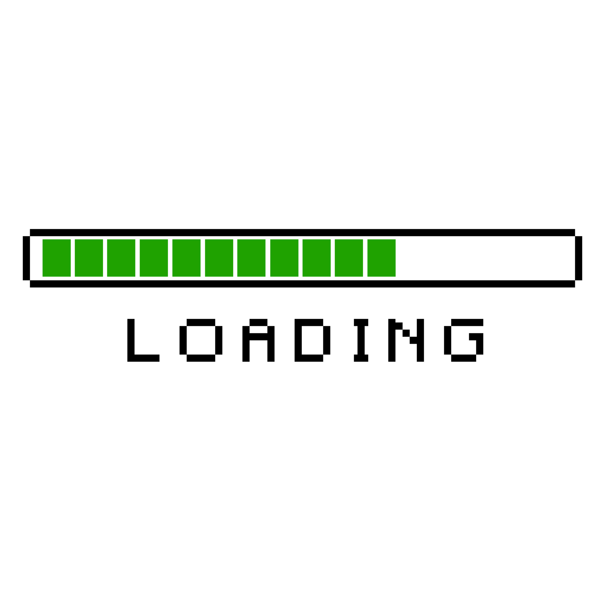
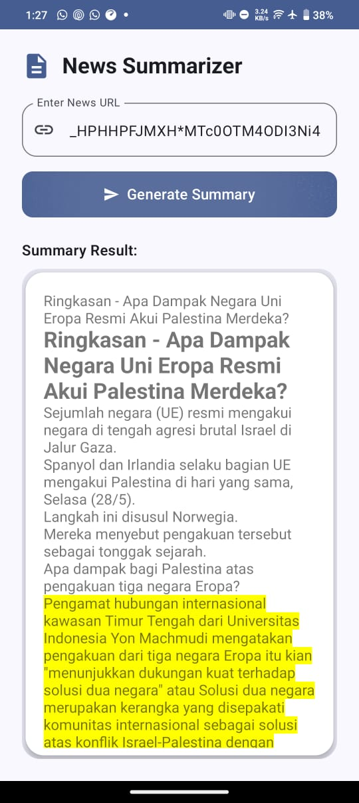

# 📰 Aplikasi Ringkasan Berita (Flask API + Kotlin Jetpack Compose)

Aplikasi Android dengan **Jetpack Compose** yang dapat meringkas artikel berita dari URL menggunakan API Flask. Cukup masukkan URL berita, dan aplikasi akan menampilkan versi ringkasnya.

---

## 🔗 API Backend Aktif

- Tersedia di: [https://web-production-b3485.up.railway.app/](https://web-production-b3485.up.railway.app/)

- Repository Github: [API-FLASK-SUMA-RAKA-V0](https://github.com/RakaAgiSaputra/summarize-api-flask-v0.git)

---

---

## 📱 Aplikasi Aktif

- Tersedia di: [Download Aplikasi Suma](app-debug.apk)

---

## 📱 Teknologi yang Digunakan

### Frontend (Android):
- **Kotlin**
- **Jetpack Compose**
- **Retrofit2** (untuk koneksi API)
- **Material3**
- **MVVM** (ViewModel)

### Backend (API):
- **Python** (Flask)
- **NLP** 
- **Railway.app** untuk hosting

---

## 🧠 Fitur Utama

- Input URL artikel berita.
- Kirim permintaan ke API Flask untuk membuat ringkasan.
- Tampilkan indikator loading saat memproses.
- Menampilkan hasil ringkasan dalam HTML yang bersih.
- UI yang adaptif, mendukung mode Gelap/Terang.
- Penanganan kondisi kosong atau kesalahan.

---

## 🖼 Pratinjau UI

| Input URL | Proses Loading | Hasil Ringkasan |
|---|---|---|
| [Url - Berita - cnnindonesia.com - Palestina Merdeka](https://www.cnnindonesia.com/internasional/20240529065909-134-1103128/negara-eropa-mulai-resmi-akui-palestina-merdeka-apa-dampaknya?_gl=1*1hblvjw*_ga*ckJxQlpCbXZKQVFpUF9McUlwVWFySk50S01xZ19Pc3MwTjBtdlR0aDdXSm5uUlpnU1NkTDlqTHlXZmxjQVV0eg..*_ga_HPHHPFJMXH*MTc0OTM4ODI3Ni4xLjEuMTc0OTM4ODI3Ni4wLjAuMA) |  |  |

---


## 🔍 Cara Kerja

### 1. Alur Pengguna
- Pengguna memasukkan URL berita.
- Klik tombol **"Generate Summary"**.
- Aplikasi mengirim permintaan ke API Flask.
- Ringkasan dikembalikan dalam format HTML.
- Hasil ditampilkan dalam `TextView` menggunakan `AndroidView`.

### 2. Format API

**Endpoint:** `POST /summarize`

**Contoh Request:**
```json
{
  "url": "https://contoh.com/artikel"
}
```


### Contoh Response:

```json
{
  "summary": "<p>Ringkasan berita dalam HTML...</p>"
}

```

## 📂 Struktur Proyek

```
app/
├── ui/
│   └── NewsSummarizerScreen.kt      # UI utama Jetpack Compose
├── viewmodel/
│   └── SummarizeViewModel.kt        # ViewModel untuk logika input dan hasil
├── network/
│   └── ApiService.kt                # Antarmuka Retrofit
│   └── RetrofitClient.kt            # Konfigurasi Retrofit
```

## 🚀 Cara Menjalankan

### 🔧 Backend (Flask)

1. Clone repository backend (jika terpisah).
2. Install dependensi:

    ```bash
    pip install -r requirements.txt
    ```

3. Jalankan server:

    ```bash
    flask run
    ```

---

### 📱 Frontend Android (Jetpack Compose)

1. Buka proyek ini di **Android Studio**.
2. Tambahkan izin internet di `AndroidManifest.xml`:

    ```xml
    <uses-permission android:name="android.permission.INTERNET" />
    ```

3. Atur base URL di `RetrofitClient.kt`:

    ```kotlin
    private const val BASE_URL = "https://web-production-b3485.up.railway.app/"
    ```

4. Jalankan aplikasi di emulator atau perangkat fisik.

---

## 📄 Lisensi

Dilisensikan di bawah MIT License.  
Hak Cipta © 2025 Raka Agi Saputra

Silakan lihat berkas `[LISENSE](LICENSE)` untuk informasi selengkapnya.

---
